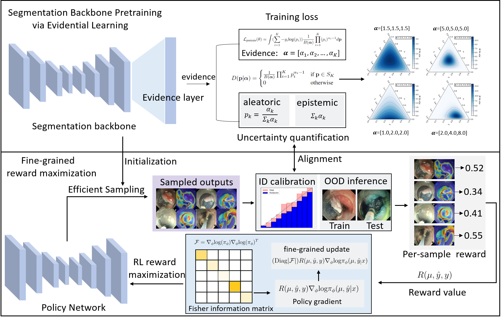

# Uncertainty Estimation for Safety-critical Scene Segmentation via Fine-grained Reward Maximization
Pytorch implementation for Uncertainty Estimation for Safety-critical Scene Segmentation via Fine-grained Reward Maximization, by [Hongzheng Yang](https://github.com/HongZhengYang), [Chen Cheng](https://cchen-cc.github.io/), [Yueyao Chen](), [Markus Scheppach](),  [Hon Chi Yip](https://www.surgery.cuhk.edu.hk/profile.asp?alias=hcyip), [Qi Dou](http://www.cse.cuhk.edu.hk/~qdou/).  

## Abstract

## Files Organization

In this repository, we provide the implementation of our uncertainty estimation method on CholecSeg8K dataset. The evidential learning implementation were adopted from [TBraTS](https://github.com/cocofeat/tbrats).

To reproduce results on AI-ENDO ESD datasets, please refer to the experiments folder.

## Datasets

The CholecSeg8K dataset can downloaded from [here](https://www.kaggle.com/datasets/newslab/cholecseg8k). 

The AI-ENDO ESD dataset can be downloaded from [here]().

## Usage

1. create conda environment
   
       conda create -n FGRM python=3.7
       conda activate FGRM
   
2. Install dependencies:

   1. install pytorch==1.7.0 torchvision==0.9.0 (via conda, recommend)

3. download the dataset

4. download the pretrained model from [google drive](https://drive.google.com/drive/folders/1-Y63KlYmBsEQp5vz3gm2IjdY8TOvidCA?usp=sharing)

5. modify the corresponding data path and model path

6. run main.py to calibrate the model

## Citation

If this repository is useful for your research, please cite:

    @article{2023FGRM,
     title={Uncertainty Estimation for Safety-critical Scene Segmentation via Fine-grained Reward Maximization},
      author={Hongzheng Yang, Cheng Chen, Markus Scheppach, Hon Chi Yip, Qi Dou},
      year={2023}
    }  

### Questions

Please feel free to contact 'hzyang05@gmail.com' if you have any questions. 
